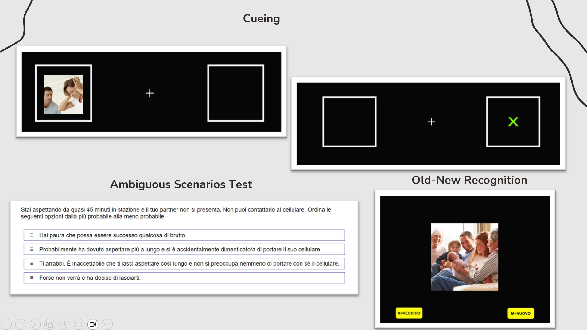

# MSc Thesis (2023): Clinical Traits and Cognitive Processing 

**Research Objective:** Investigation into the interaction between clinical traits (Attachment, Anxiety) and cognitive processing (Attention, Memory, Interpretation).

---

##  Ethics & Privacy
* **Institutional Approval:** Approved by the Ethics Committee of the **University of Campania "Luigi Vanvitelli"**.
* **Informed Consent:** Mandatory digital consent block (6 requirements) before participation.
* **Data Privacy:** Guaranteed absolute anonymity through custom-generated codes.

---

## Experimental Protocol & Task Sequence
The study was divided into multiple sections, implemented via **PsyToolkit** scripting:

###  Phase 1: Assessment & Psychometrics
1. **Demographics:** Age, gender, sexual orientation, and relationship status.
2. **ECR-12 (Experience in Close Relationship):** A 12-item self-assessment scale measuring adult attachment styles.
3. **STAI-Y2 (State-Trait Anxiety Inventory):** A 20-item inventory evaluating generic stress and trait anxiety.
4. **LCSQ (Looming Cognitive Style Questionnaire):** Evaluation of cognitive reactions to hypothetical threat scenarios.
   * *Technical Note:* Implemented using `range` sliders (1-5) for subjective threat probability.
5. **AST (Ambiguous Scenarios Test):** Measuring interpretation bias in social stories.
   * *Technical Note:* Implemented using `rank` logic to order possible behavioral responses.

###  Phase 2: Cognitive Paradigms
6. **Posner Cueing Task:** Spatial attention task.
   * *Procedure:* Participants respond to a green "X" appearing on the left or right after a visual cue.
   * *Logic:* Fixation (500ms) → Cue (200ms) → Delay (500ms) → Target.
7. **Recognition Memory Task:** Encoding and retrieval of emotional stimuli.
   * *Procedure:* Presentation of images (emotional/neutral) and subsequent recognition test.
   * *Logic:* 1000ms image presentation followed by an Old/New discrimination phase.

---

###  Experimental Interface Preview
Below is a visual representation of the cognitive tasks implemented in Phase 1 (Ambiguous Scenarios Test) and 2 (Posner and Memory Recognition):

*The image shows the visual stimuli and response interface designed via PsyToolkit scripting.*

## Technical Scripts (.psy)
The scripts in this folder demonstrate advanced **PsyToolkit** capabilities:
* `assessment_battery.psy`: Handles points 1 to 5, including custom anonymization logic.
* `posner_cueing_task.psy`: Implements the attentional shift paradigm.
* `recognition_memory_task.psy`: Manages the stimuli randomization and memory encoding/retrieval.

---

##  Technical Implementation
* **Modular Scripting:** Separate files for psychometric batteries and cognitive tasks to optimize data flow.
* **Ethics & GDPR:** Mandatory digital consent blocks and custom anonymization algorithms for full data protection.

---

##  Experimental Results

The study was implemented via PsyToolkit and analyzed using IBM SPSS v21.0. 

### Assessment & Psychometrics
* **ECR-12 & STAI-Y2:** Integrated assessment of adult attachment styles and trait anxiety.
* **Looming Cognitive Style (LCSQ):** Anxious individuals perceived physical threats as significantly more imminent and "speeding up" compared to secure and avoidant groups.
* **Ambiguous Scenarios Test (AST):** Disorganized attachment styles showed a significant bias toward "Anger" interpretations in social scenarios.
### Cognitive Paradigms & Findings
* **Posner Cueing Task:** * Anxious participants showed a trend toward faster overall reaction times.
    * General findings across all groups indicated an initial avoidance of positive stimuli (100ms) followed by difficulty disengaging from both positive and negative cues (500ms).
* **Old-New Recognition Task:** * Negative social stimuli were recognized with higher accuracy compared to neutral and positive ones.
    * Positive images were more likely to cause "false alarms," showing a higher response bias (mistaken for already seen).

##  References
* **Posner, M. I. (1980).** Orienting of attention.
* **Brennan, K. A., et al. (1998).** ECR scale.
* **Spielberger, C. D. (1983).** STAI inventory.
* **Riskind, J. H., et al. (2000).** LCSQ.
* **Berna, G., et al. (2011).** AST.
